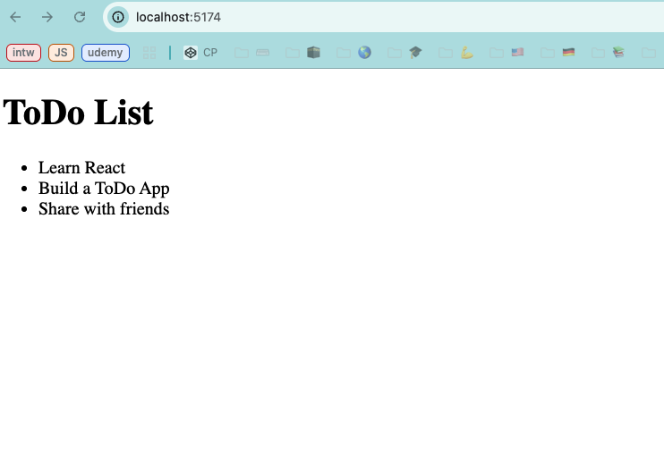

# 📝 Todo List App

A simple and clean Todo List application built with  **HTML**, **React JS**,  and **Vite**. This app allows users to manage daily tasks with a minimal and intuitive user interface.

## 📦 Installation

### Prerequisites:
- Node.js (v14 or newer)
- npm (comes with Node.js)

### Steps:

Follow these steps to get the project up and running on your local machine:

1.  **Clone the repository:**
    ```bash
    git clone [https://github.com/ErmatovRustam/todo-list.git](https://github.com/ErmatovRustam/todo-list.git)
    ```
2.  **Navigate to the project directory:**
    ```bash
    cd todo-list
    ```
3.  **Install dependencies:**
    ```bash
    npm install
    ```
4.  **Start the development server:**
    ```bash
    npm run dev
    ```
    This command will typically open the application in your browser at `http://localhost:5173` (or a similar port).

---

## 🚀 Features

- ✅ Add new tasks
- ❌ Remove completed tasks
- ✏️ Edit existing tasks
- 📌 Mark tasks as complete/incomplete

## 📸 Screenshots



## 🔧 Technologies Used

- **HTML5**
- **React JS**
- **Vite**

## 📁 Project Structure

